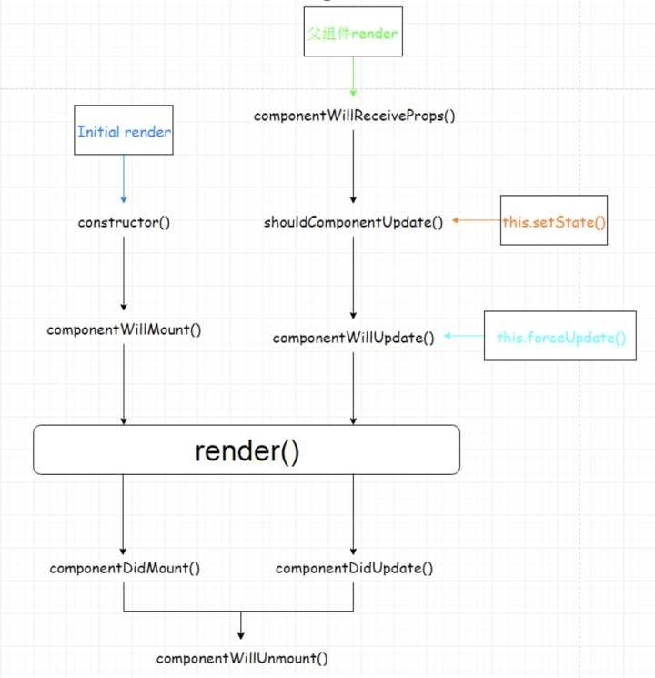

- 在vue中父组件怎么调用子组件的方法
    - 通过ref调用即可，但是ref是dom节点出来之后才能用的，也就是render函数执行完毕，mounted钩子之后
    ```html
    <template>
      <div>
        <button @click="clickParent">点击</button>
        <child ref="mychild"></child>
      </div>
    </template>
    ```
    ```js
    <script>
      import Child from './child';
      export default {
        name: "parent",
        components: {
          child: Child
        },
        methods: {
          clickParent() {
            this.$refs.mychild.parentHandleclick("I'm dad");
          }
        }
      }
    </script>
    ```
- iframe的用法
- react中怎么监听数据的变化
    - 如果单纯 React 的话 如果状态发生变化，会触发组件生命周期中的如下方法：
    ```js
    componentWillUpdate(object nextProps, object nextState) 
    componentDidUpdate(object prevProps, object prevState) 
    ```
    - 如果使用 Redux 等的话，一般状态变化是由 Dispatch 引起的，你在 Dispatch 的回调中执行你想要的就可以了。
        - 可以看看这张图学习一下 React 的生命周期。
    
    - 场景：假设有这样一个场景，父组件传递子组件一个A参数，子组件需要监听A参数的变化转换为state。
    - 16之前
        - 在React以前我们可以使用componentWillReveiveProps来监听props的变换
    - 16之后
        - 在最新版本的React中可以使用新出的getDerivedStateFromProps进行props的监听，getDerivedStateFromProps可以返回null或者一个对象，如果是对象，则会更新state
        - getDerivedStateFromProps触发条件
            - 我们的目标就是找到 getDerivedStateFromProps的 触发条件
            - 我们知道，只要调用setState就会触发getDerivedStateFromProps，并且props的值相同，也会触发getDerivedStateFromProps(16.3版本之后)

