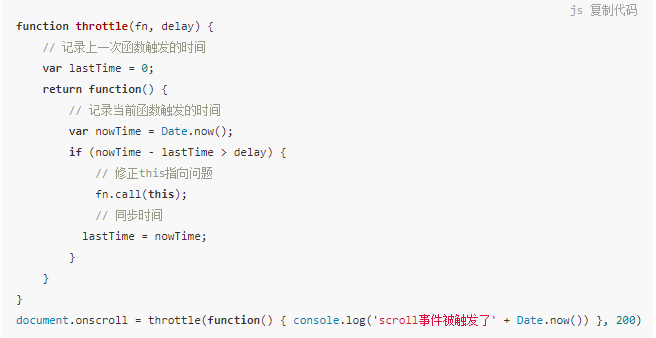
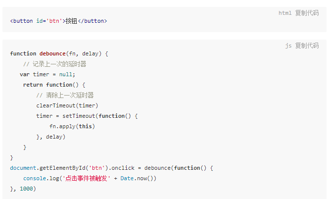

### 函数节流

- 定义
  - 一个函数执行一次后，只有大于设定的执行周期后才会执行第二次。

- 应用场景
  - DOM 元素的拖拽功能实现（mousemove）
  - 计算鼠标移动的距离（mousemove）
  - 射击游戏的 mousedown/keydown 事件（单位时间只能发射一颗子弹）

- 代码实现

例中用到了闭包的特性--**可以使变量lastTime的值长期保存在内存中**

### 函数防抖

- 定义
  - 一个需要频繁触发的函数，在规定时间内，只让最后一次生效，前面的不生效。

- 应用场景
  - 每次 resize/scroll 触发统计事件
  - 文本输入的验证（连续输入文字后发送 AJAX 请求进行验证，验证一次就好）

- 代码实现

上例中也用到了闭包的特性--**可以使变量timer的值长期保存在内存中**