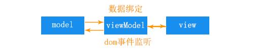

## MVVM定义

MVVM是Model-View-ViewModel的简写。即模型-视图-视图模型。

【模型】指的是后端传递的数据。

【视图】指的是所看到的页面。

【视图模型】是mvvm模式的核心，它是连接view和model的桥梁。

【视图模型】它有两个方向：

一是将【模型】转化成【视图】，即将后端传递的数据转化成所看到的页面。实现的方式是：数据绑定。

二是将【视图】转化成【模型】，即将所看到的页面转化成后端的数据。实现的方式是：DOM事件监听。

这两个方向都实现的，我们称之为数据的双向绑定。

**总结：** 在MVVM的框架下视图和模型是不能直接通信的。它们通过ViewModel来通信，

ViewModel通常要实现一个observer观察者，

当数据发生变化，ViewModel能够监听到数据的这种变化，然后通知到对应的视图做自动更新，

而当用户操作视图，ViewModel也能监听到视图的变化，然后通知数据做改动，

这实际上就实现了数据的双向绑定。

并且MVVM中的View 和 ViewModel可以互相通信。

- MVVM流程图如下：

## MVVM框架:VUE的介绍

Vue就是基于MVVM模式实现的一套框架，

在vue中：

Model:指的是js中的数据，如对象，数组等等。

View:指的是页面视图。

viewModel:指的是vue实例化对象。

### 为什么说VUE是一个渐进式的javascript框架, 渐进式是什么意思？

1.如果你已经有一个现成的服务端应用，你可以将vue 作为该应用的一部分嵌入其中，带来更加丰富的交互体验;

2.如果你希望将更多业务逻辑放到前端来实现，那么VUE的核心库及其生态系统也可以满足你的各式需求（core+vuex+vue-route）。
和其它前端框架一样，VUE允许你将一个网页分割成可复用的组件，每个组件都包含属于自己的HTML、CSS、JAVASCRIPT以用来渲染网页中相应的地方。

3.如果我们构建一个大型的应用，在这一点上，我们可能需要将东西分割成为各自的组件和文件，
vue有一个命令行工具，使快速初始化一个真实的工程变得非常简单。
我们可以使用VUE的单文件组件，它包含了各自的HTML、JAVASCRIPT以及带作用域的CSS或SCSS。

以上这三个例子，是一步步递进的，也就是说对VUE的使用可大可小，它都会有相应的方式来整合到你的项目中。所以说它是一个渐进式的框架。

**VUE最独特的特性：响应式系统VUE是响应式的（reactive），** 也就是说当我们的数据变更时，VUE会帮你更新所有网页中用到它的地方。

## vue实现双向绑定（响应式）的做法

观察者-订阅者（数据劫持）

Observer 数据监听器，把一个普通的 JavaScript 对象传给 Vue 实例的 data 选项，Vue 将遍历此对象所有的属性，并使用Object.defineProperty()方法把这些属性全部转成setter、getter方法。当data中的某个属性被访问时，则会调用getter方法，当data中的属性被改变时，则会调用setter方法。

Compile指令解析器，它的作用对每个元素节点的指令进行解析，替换模板数据，并绑定对应的更新函数，初始化相应的订阅。

Watcher 订阅者，作为连接 Observer 和 Compile 的桥梁，能够订阅并收到每个属性变动的通知，执行指令绑定的相应回调函数。

Dep 消息订阅器，内部维护了一个数组，用来收集订阅者（Watcher），数据变动触发notify 函数，再调用订阅者的 update 方法

- 执行流程如下：

从图中可以看出，当执行 new Vue() 时，Vue 就进入了初始化阶段，

一方面Vue 会遍历 data 选项中的属性，并用 Object.defineProperty 将它们转为 getter/setter，实现数据变化监听功能；

另一方面，Vue 的指令编译器Compile 对元素节点的指令进行解析，初始化视图，并订阅Watcher 来更新视图， 此时Wather 会将自己添加到消息订阅器中(Dep),初始化完毕。

当数据发生变化时，Observer 中的 setter 方法被触发，setter 会立即调用Dep.notify()，Dep 开始遍历所有的订阅者，并调用订阅者的 update 方法，订阅者收到通知后对视图进行相应的更新。

因为VUE使用Object.defineProperty方法来做数据绑定，而这个方法又无法通过兼容性处理，所以Vue 不支持 IE8 以及更低版本浏览器。

另外，查看vue源代码，发现在vue初始化实例时， 有一个proxy代理方法，它的作用就是遍历data中的属性，把它代理到实例vm上，这也就是我们可以这样调用属性：vm.aaa等于vm.data.aaa。
